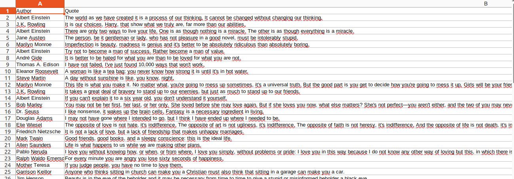

# Quotes to Scrap JS
Um Web Scraper simples feito com Selenium para fins didáticos. Captura elementos de texto do site [Quotes to Scrape](https://quotes.toscrape.com/js/) e os salva em formato CSV.

### Selenium Webdriver:

### CSV (Libreoffice Calc):
